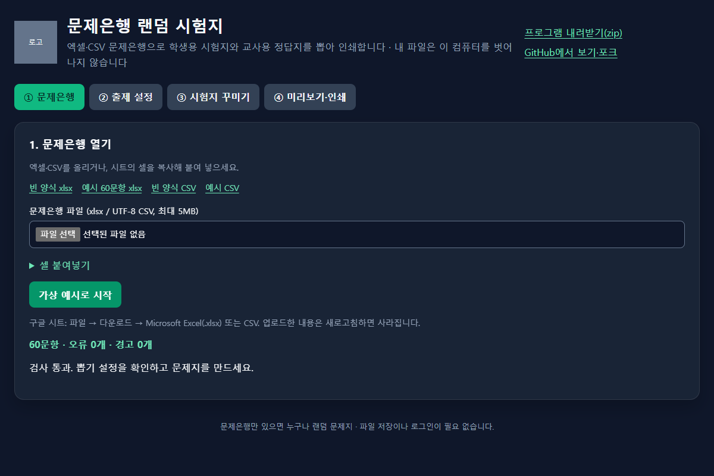

# 문제은행 랜덤 시험지 — `dist/index.html`을 연다

문제은행만 있으면 누구나 랜덤 문제지. 엑셀·CSV를 이 컴퓨터 브라우저에서 읽고, 학생용 문제지와 교사용 정답지를 A4로 인쇄합니다. 인터넷·로그인·서버 저장 없이 씁니다.

## 사용법 (10줄)
1. 배포 zip을 풀고 `dist/index.html`을 Chrome 또는 Edge로 엽니다.
2. 빈 양식을 내려받거나 가상 예시 60문항(기본 출제 20문항)으로 시작합니다.
3. xlsx의 `시험정보` 시트에 학교명·시험제목·과목·문항수를 적습니다.
4. `문항` 시트에 선택형(4지·5지) 또는 단답형을 적습니다.
5. 구글 시트는 xlsx/CSV로 다운로드하거나 셀을 탭 구분으로 붙여 넣습니다.
6. 파일을 열고 오류의 행을 고친 뒤 다시 엽니다.
7. ② 출제 설정에서 전체·선택·단답 개수, 난이도 개수 또는 %, 단원 균등·보기 섞기·쪽 수를 정합니다.
8. 시드를 적고 문제지를 만듭니다. ③ 시험지 꾸미기에서 인쇄 문구·로고·글자 크기를 고치면 같은 문항에 즉시 반영됩니다.
9. 학생용 또는 교사용을 확인하고 각각의 인쇄 버튼을 누릅니다.
10. A4 세로·배율 100%·브라우저 머리글/바닥글 끄기로 인쇄하거나 PDF로 저장합니다.

## 양식 열
`시험정보`는 항목/값 두 열입니다. 학교명, 시험제목, 과목, 학년반, 시험시간, 안내문구, 문항수, 난이도비율을 씁니다. 파일 값은 머리글의 초기값이고, 화면에서 수정한 값이 우선합니다. 끄거나 비우면 표시하지 않습니다. 학년·반은 비우면 밑줄 칸으로 남습니다. 번호·이름은 값을 입력하지 않고 빈 칸만 인쇄합니다.

`문항` 열: 번호(선택), 유형(선택/단답/4지/5지, 빈칸이면 보기로 판단), 문제, 보기1~5, 정답, 난이도(상/중/하), 단원, 해설. 선택형은 보기1~4가 필수이며 보기5를 채우면 5지입니다. 정답은 저장 보기 순서의 1~4 또는 1~5 번호입니다. 단답은 보기 칸을 모두 비우고 정답을 글자로 적습니다. 여러 허용 답은 `|`로 구분합니다. 단답 비교는 원본 엔진처럼 모든 공백을 제거하되 대소문자는 구분합니다.

CSV는 `시험정보`의 키·값 행, 빈 행, 문항 열 이름, 문항 행 순서입니다. 제공 CSV를 참고하세요. 문항 열 이름부터만 붙여 넣어도 됩니다. TSV에 시험정보가 없으면 머리글 값은 비어 있습니다(기억한 편집값은 적용). UTF-8 CSV를 사용하세요. 수식은 계산하지 않으므로 값으로 붙여 넣고 저장하세요.

① 문제은행 → ② 출제 설정 → ③ 시험지 꾸미기 → ④ 미리보기·인쇄의 네 탭을 사용합니다. 탭은 좌우 화살표로 이동하고, 입력값은 그대로 유지됩니다. 문제은행 검사 통과 전에는 안내와 비활성 입력을 보여줍니다. ②를 고치면 다시 만들기가 필요하고, ③을 고치면 기존 문항을 다시 배치합니다.

전체 문항 수를 바꾸면 현재 유형·난이도 비율을 유지해 정수 개수를 제안합니다. 선택 또는 단답 개수를 바꾸면 다른 유형을 전체 문항 수에 맞추며, 입력 개수가 전체보다 크면 전체도 늘립니다. 유형별 개수가 은행보다 크면 최대 가능 수를 알려 줍니다. 기본 제안은 은행의 선택·단답 비율입니다.

난이도는 개수 합계가 전체 문항 수, % 합계가 100이 되도록 적습니다. %는 최대 나머지 방식으로 정수 개수로 환산합니다. 고급 `상2:중5:하3` 입력은 ‘위 입력에 반영’을 눌러 적용합니다. 파일의 난이도비율은 초기값입니다. 빈 난이도는 중으로 셉니다. 유형별 개수를 먼저 지키며 전체 난이도의 차이를 최소화하고, 못 채운 난이도와 대체 난이도를 알립니다. 단원 균등은 유형·난이도별 부분집합 안에서 적용하며, 부족한 단원은 다른 단원으로 채웁니다.

예시는 직접 쓴 가상 60문항(4지 30·5지 12·단답 18)입니다. 상·중·하가 두 유형마다 최소 4개씩 있고 단원은 5개입니다. 모든 문항에 해설이 있습니다.

## 빌드·시험
Node.js 22.6 이상(권장 24), npm을 사용합니다. 이 폴더만 다른 저장소로 옮겨도 됩니다.
```
npm install --workspaces=false
npm run templates
npm run check-vendor
npm test
npm run build
npm run release
```
`dist/index.html`은 `file://`로 동작합니다. `print-sheet.zip`에는 실행 파일과 빈 양식·예시·문서가 포함됩니다. 모노레포에서 `check-vendor`는 원본과 8개 파일의 SHA256을 비교합니다. 공개 저장소에서는 '건너뜀'을 출력하며 자체 시험은 계속 실행합니다.

사이트 링크는 `site.config.json`의 세 값(`videoUrl`·`downloadUrl`·`repositoryUrl`)으로 정합니다. 선택 값 `videoUrl`은 ‘사용 영상 보기’를 맨 앞에 표시합니다. 값이 없거나 비어 있거나 `TODO-URL`이면 숨기며, `https://` 또는 `./`로 시작하는 주소만 표시합니다. 기본 로고는 회색 자리표시자입니다. 배포용 로고는 `npm run build -- --logo <이미지 경로>` 또는 `PRINT_SHEET_LOGO` 환경변수로 넣습니다. 배포의 `dist/assets/logo.*`에만 들어가며 소스에 복사하지 않습니다. `npm run release`는 기본값으로 다시 빌드하여 학교 로고를 zip에서 제외합니다.

**로고는 코드 라이선스에 포함되지 않음 — 포크할 때 자기 학교 로고로 바꾸세요**.

## 호환성과 한계
표준 문항 v0.1은 4지선다만 정의합니다. 5지는 사이트 확장 타입과 자체 검사를 거친 뒤 배열 기반 섞기·뽑기에 전달합니다. 종이 쪽 나눔은 사이트의 높이 기준 함수이며, 유형이 바뀌어도 공간이 있으면 이어서 채웁니다. 원본 엔진과 검사기를 수정하지 않습니다. 5지 채점 기능은 이 사이트에 없으며 원본 `grade(choice)`의 4지 제한에 의존하지 않습니다.

SheetJS `xlsx` 0.18.5(Apache-2.0, 기존 저장소에 설치된 버전)와 esbuild를 사용합니다. 이 파서는 오래된 버전입니다. 파서 작업은 일회성 Worker로 격리하고 5MB·5,000문항·8초 제한을 두지만 악성 파일 처리에 대한 완전한 보장은 아닙니다. 교사가 작성한 파일만 사용하고 공개 운영 전 파서 최신 배포의 보안 검토를 권합니다. 외부 스크립트·CDN·폰트·통신은 없으며 CSP `connect-src 'none'`을 선언합니다. CSP는 인라인 스타일과 로컬 파일·Blob Worker를 허용합니다.

쪽 수 맞춤은 기본 **자동**입니다. 선택한 9.5/11/13pt를 그대로 유지합니다. 목표 1~4쪽을 선택하면 필요할 때 9.5pt까지 줄이고 알립니다. 그래도 넘으면 현재 쪽 수로 인쇄합니다. 홀수 쪽이 작은 글자로 짝수 쪽에 들어갈 때 안내와 ‘작게 해서 다시 만들기’를 보여 주며, 누를 때만 글자 크기를 바꿉니다. 문항 수·보기 길이·머리글 높이에 따라 쪽 수가 달라집니다.

한 페이지보다 긴 문항은 경고와 함께 단독 논리 쪽에 넣으며, 실제 인쇄에서는 다음 용지까지 이어질 수 있습니다. 4지는 4→2→1열, 5지는 5→3→2→1열을 시도합니다. 가장 긴 보기 기준 동일 열 폭과 최소 16px(약 4.2mm) 간격을 확보합니다. 한 열로도 너무 긴 보기는 줄바꿈합니다. 교사용은 5개씩 놓은 정답표 뒤에 해설을 모아 인쇄합니다.

머리글·바닥글 편집값만 `localStorage`에 기억합니다. 새 파일은 시험정보를 초기값으로 쓰며, 직접 편집해 기억한 항목만 덮어씁니다. '파일 값으로 초기화'는 기억한 편집값을 지우고 현재 파일 값으로 되돌립니다. 저장이 막히거나 로고가 커 저장 용량을 넘으면 안내하고 현재 화면에서는 계속 동작합니다. 문제은행은 보관하지 않습니다. 안내문구에는 학생 이름·성적 등 개인정보를 적지 마세요. 시험지 로고는 교사가 PNG·JPG·SVG(5MB 이하)를 선택하는 기능이며 사이트 맨 위 배포용 로고와 별개입니다. SVG는 HTML에 삽입하지 않고 이미지로만 표시합니다.


